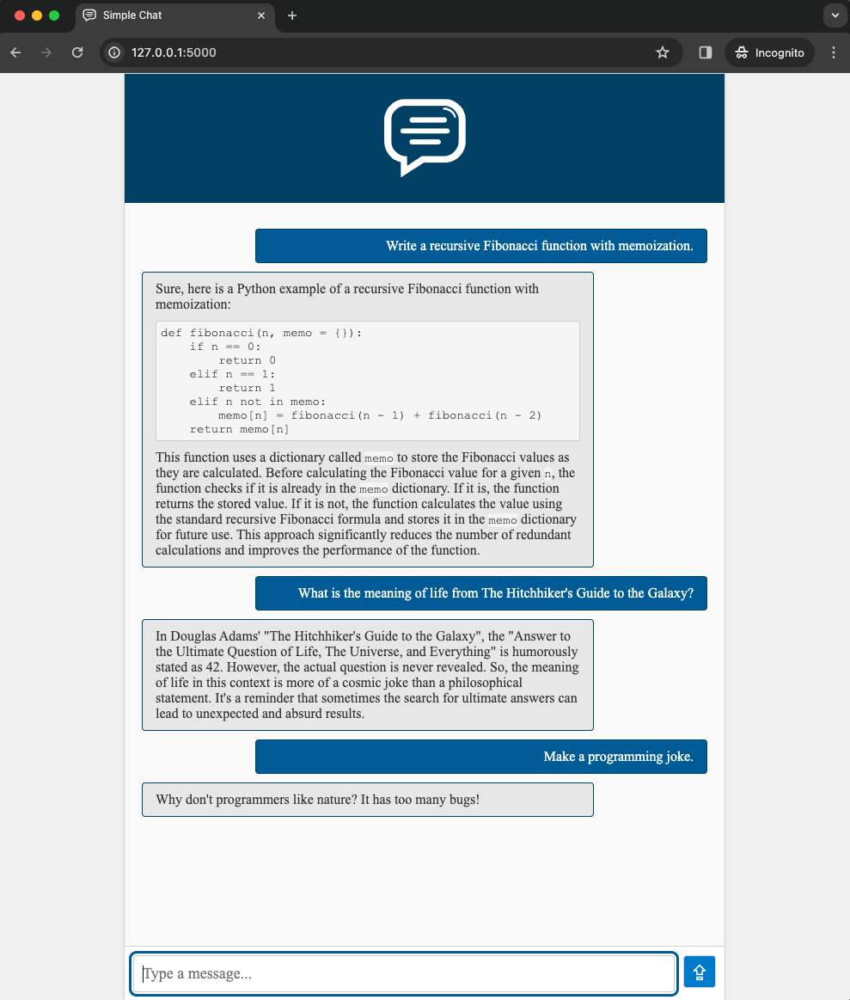

# Simple Chat

## Description
This Simple Chat is designed as a straightforward, real-time chat interface using Flask for the backend and basic HTML/CSS/JavaScript for the frontend. It's created as a response to more complex solutions, offering a simple, effective baseline for building chat bots and Retrieval-Augmented Generation (RAG) systems. Its simplicity makes it an ideal starting point for customizations and further developments in chatbot technology.


Example with the Mixtral LLM backend.


## Installation
To set up this project on your local machine, follow these steps:

1. **Clone the Repository**
   ```bash
   git clone https://github.com/bbenko/simple-chat.git
   cd simple-chat
   ```

2. **Install Dependencies**
   Make sure you have Python installed on your system. Then, install Flask:
   ```bash
   pip install flask
   ```

3. **Run the Application**
   ```bash
   python app.py
   ```
   This will start the Flask server on `http://127.0.0.1:5000`.


## Usage
After starting the server, navigate to `http://127.0.0.1:5000` in your web browser to use the chat application.

1. Type your message in the input box.
2. Press Enter or click the Send button to send the message.
3. View the response from the server in the chat interface.

## Chat Agents
By default, the `echo` agent is loaded which just repeats the message from the client. It also has a sample code as an example to create different agents.

### LLM agent
This agent talks to a cloud LLM (like ChatGPT) and sends replies to users. There is no chat history support. It works with OpenAI and other platforms that are compatible with OpenAI's API, like Together AI. Find all paremeters in [llm_agent.py](agents/llm_agent.py).

To use Mixtral model from Together AI, set up these enviroment variables:
```bash
export SIMPLE_CHAT_AGENT=llm
export LLM_API_KEY=<your Together AI>
export LLM_MODEL=mistralai/Mixtral-8x7B-Instruct-v0.1
```

To use OpenAI, also set
```bash
export LLM_BASE_URL=https://api.openai.com/v1
```


## Testing
To run the tests for this project, follow these steps:

1. **Install Testing Dependencies**
   ```bash
   pip install selenium
   ```

2. **Run the Tests**
   ```bash
   python test.py
   ```
   This will execute all the tests and display the results.


## Contributing
Contributions to this project are welcome. Please follow these steps to contribute:

1. Fork the repository.
2. Create a new branch (`git checkout -b feature/AmazingFeature`).
3. Commit your changes (`git commit -m 'Add some AmazingFeature'`).
4. Push to the branch (`git push origin feature/AmazingFeature`).
5. Open a pull request.

## License
Distributed under the MIT License. See `LICENSE` for more information.

Project Link: [https://github.com/bbenko/simple-chat](https://github.com/bbenko/simple-chat)
